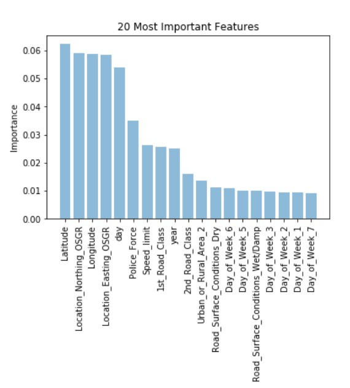

# Car Accident Analysis in the UK 

The following ML process tends to analyze heat points and causes of accidents in UK (England, Scotland, Wales).
Source: https://www.kaggle.com/daveianhickey/2000-16-traffic-flow-england-scotland-wales

Team: Julio Candela, Valdemar Hernandez, Hung Nguyen, Ariston Lim

There were more than 400,000 accidents occuring in the UK from 2012 to 2014. This means that on average, there are around 365 accidents happening daily. Thus, there is an urgent need to understand and dig deeper into these accidents: how and why they happened. Fortunately, the UK Police Department stored comprehensive information about the accidents. From this we could perform data analysis and even predict when accidents might happen. There are 3 main focus in this report:
* Pre processing and Bivariate analysis
* DBSCAN: Clusterization to identify heatmaps
* Machine Learning models to predict, and hence, prevent fatal accidents and its causes

### 1) Pre processing and Bivariate analysis

Bivariate analysis is the simultaneous analysis of two variables (attributes). It explores the concept of relationship between two variables, whether there exists an association and the strength of this association, or whether there are differences between two variables and the significance of these differences.

After doing this analysis, some features needed further pre-processing, such as missing values, splitting into smaller features, changing type from numerical to categorical, etc

* Creating new features
* Dealing With Missing Values
* Feature Elimination
* Preparing train/test dataset
* Feature Importance

### 2) DBSCAN: Clusterization to identify heatmaps

As a preliminary method, heatmaps were created for the total accidents and fatal accidents using the folium library

To get a better accuracy on the hot spots for the location, we performed a DBSCAN algorithm to cluster the accidents together. Initially, we use 100 000 data points and then we apply this model to the entire data set. We also calculate the centroids for these hot spots. The results are as follows:

### 3) Machine Learning models to predict, and hence, prevent fatal accidents and its causes

#### Algorithms evaluated:

* Random Forest
* XGBoost
* LightGBM
* Neural Networks
* AdaBoost

#### Experimentation

##### 5 Iteration process

After preparing the data, 5 experiments were carried out in order to test each one of the models described in the section below. Every new experiment had the intention to improve the result obtained in the previous one. Testing the models using the same 5 experiments for each one helps to determine which one makes the best prediction for the accident severity without having bias from different data processing or the handling of the models’ parameters.

* Unbalanced dataset: The original dataset contains unbalanced data, which can be observed by counting the number of samples for each type of Accident Severity
* Undersampling: The number of samples with serious or slight accidents was reduced to the same amount of existing samples for fatal accidents
* Normalization: For the third experiment, the undersampled data was normalized. Data normalization is used to scale the data of an attribute to make it fit in a different range (normally between 0 and 1).
* Hyperparameter Tuning: Grid search is an approach to hyperparameter tuning that will methodically build and evaluate a model for each combination of algorithm parameters specified in a grid (Paul, 2018). This means that, for a user-defined set of values for the hyperparameters, the grid search will run the model using all possible combinations in order to identify which one provides the best estimator. The Scikit-Learn library for Python contains a method that performs this grid search, called GridSearchCV()
* Feature Selection: A customized function was generated in order to fit the models into datasets with different numbers of features. The ROC resulting value was then compared with the maximum ROC value obtained so far; if the new value was better, the number of features was stored in a variable called best_dim. This value was then used to shorten the features of the dataset and keep only the [best_dim] most important features. The most important features had already been identified during the data preparation, so this did not require additional processing

#### Main Causes

The feature importance from the RandomForest let us identify main causes in the car accidents issue:

#### Results

The results are shown in ROC. The best algorithm was LightGBM

In a graphical way:

#### Conclusions

* Birmingham, Glasgow, Bristol, Coventry, Stoke-on-Trent have a high ratio of fatal accidents. Thorncliffe and London account for 50% of the total amount of fatal accidents. Moreover, this clusterization is pivotal not only to know the main points, but also to assign a cluster to every row which can be an input in the following models
* Data is the most valuable asset only if we can understand its influence in the problem. For this reason, variable statistics, bivariate graphics (against the target variable) combined with the domain expertise is a rule of thumb when planning a data mining project.
* Based on the information provided by the UK government, it was possible to determine some of the most important factors involved in fatal accidents. However, this required several steps to be completed so a conclusion could be reached. After understanding data that was available, it was necessary to prepare it in order to not only identify which information could be useful, but also to make the necessary adjustments on it so it could be used with different modeling techniques. Using the processed data, it was possible to observe that a fatal accident is more likely to happen while driving at high speed limits, poor lighting conditions on the road and also driving in rural areas. Another factor that is also important is the current condition of the road surface (whether it is dry or wet). We would recommend actions to be taken on these variables to potentially reduce the amount of fatal accidents.
* In order to predict fatal accidents, several models were used to identify one that could provide the best predictor and help to prevent accidents. After running the data through 5 experiments implemented for 5 different models, the results show that the LightGBM algorithm identifies with greater accuracy the potential accident severity based on the features previously identified. This would be the recommended model to use in order to better identify when, according to the current conditions, an accident could be fatal and take the precautionary actions.

